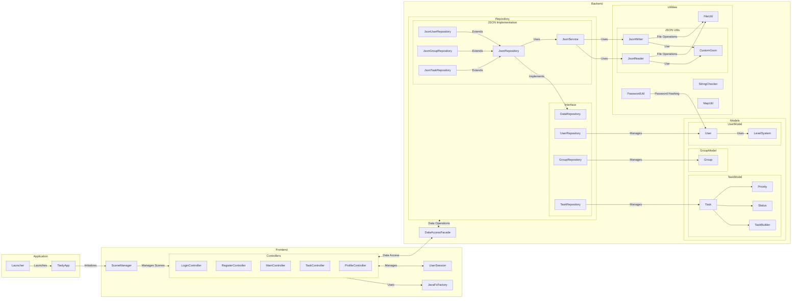

```mermaid
flowchart LR
    subgraph Application
        Launcher[Launcher]
        TiedyApp[TiedyApp]
    end
    Launcher -->|Launches| TiedyApp

    subgraph Frontend
        SceneManager[SceneManager]
        JavaFxFactory[JavaFxFactory]
        UserSession[UserSession]

        subgraph Controllers
            LoginController[LoginController]
            RegisterController[RegisterController]
            MainController[MainController]
            TaskController[TaskController]
            ProfileController[ProfileController]
        end
    end

    TiedyApp -->|Initializes| SceneManager
    SceneManager -->|Manages Scenes| Controllers
    Controllers -->|Uses| JavaFxFactory
    Controllers <-->|Manages| UserSession

    subgraph Backend
        DataAccessFacade[DataAccessFacade]

        subgraph Repository
            subgraph Interface
                DataRepository[DataRepository]
                UserRepository[UserRepository]
                GroupRepository[GroupRepository]
                TaskRepository[TaskRepository]
            end

            UserRepository & GroupRepository & TaskRepository

            subgraph JsonImpl["JSON Implementation"]
                JsonRepository[JsonRepository]
                JsonService[JsonService]
                JsonUserRepo[JsonUserRepository]
                JsonGroupRepo[JsonGroupRepository]
                JsonTaskRepo[JsonTaskRepository]
            end
        end

        subgraph Models
            subgraph UserModel
                User[User]
                LevelSystem[LevelSystem]
            end

            subgraph GroupModel
                Group[Group]
            end

            subgraph TaskModel
                Task[Task]
                TaskBuilder[TaskBuilder]
                Status[Status]
                Priority[Priority]
            end
        end

        subgraph Utilities
            FileUtil[FileUtil]
            StringChecker[StringChecker]
            PasswordUtil[PasswordUtil]
            MapUtil[MapUtil]

            subgraph JsonUtils["JSON Utils"]
                JsonReader[JsonReader]
                JsonWriter[JsonWriter]
                CustomGson[CustomGson]
            end
        end
    end

    Controllers <-->|Data Access| DataAccessFacade
    DataAccessFacade <-->|Data Operations| Repository
    JsonRepository -->|Implements| DataRepository
    JsonRepository -->|Uses| JsonService
    JsonUserRepo -->|Extends| JsonRepository
    JsonGroupRepo -->|Extends| JsonRepository
    JsonTaskRepo -->|Extends| JsonRepository
    JsonService -->|Uses| JsonReader & JsonWriter
    JsonReader & JsonWriter -->|Use| CustomGson
    UserRepository -->|Manages| User
    GroupRepository -->|Manages| Group
    TaskRepository -->|Manages| Task
    User -->|Uses| LevelSystem
    Task --> TaskBuilder
    Task --> Status
    Task --> Priority
    JsonReader & JsonWriter -->|File Operations| FileUtil
    PasswordUtil -->|Password Hashing| User

```