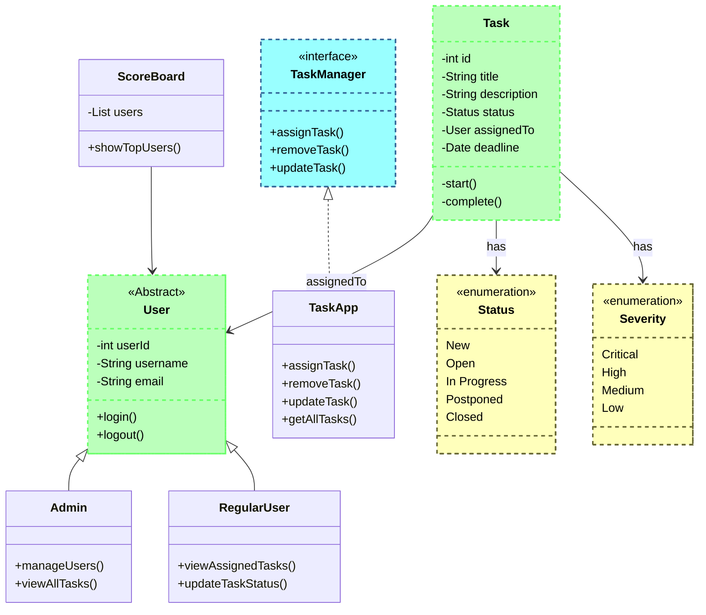

Project Description
===================
Tiedy is a to-do app aimed to solve the modern problem of time management.
It is optimized for everyday home chore tasks, with a leveling system to novitiate users to compete on the leader board.

Project Structure
=================



Running the project
===================
This project uses JDK 21 and maven 3.9.9 as the build system.
To build and run the program from scratch, clone the repository and run the following maven command:
```bash
mvn -q clean javafx:run
```
