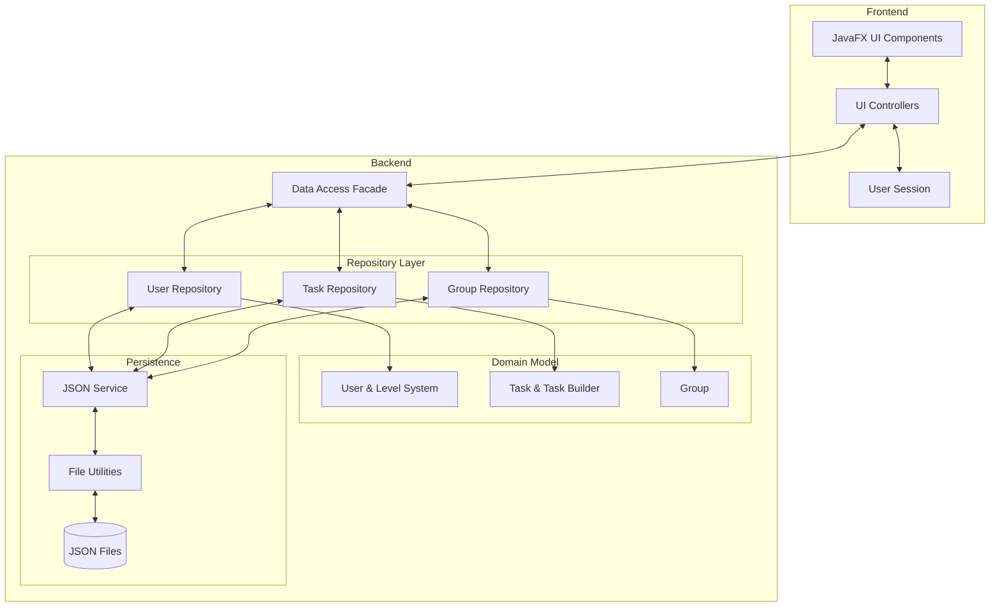

Project Description
===================
Tiedy is a to-do app aimed to solve the modern problem of time management.
It is optimized for everyday home chore tasks, with a leveling system to novitiate users to compete on the leader board.

Project Structure
=================



Running the project
===================
Java 21 is required to run this project.
After ensuring the correct java version has been installed, run the following command:

```bash
./mvnw -q
```